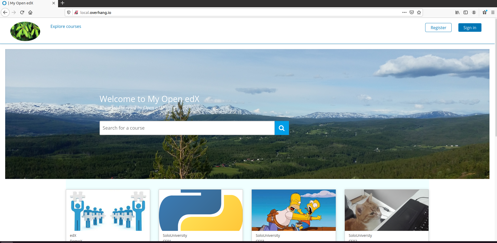
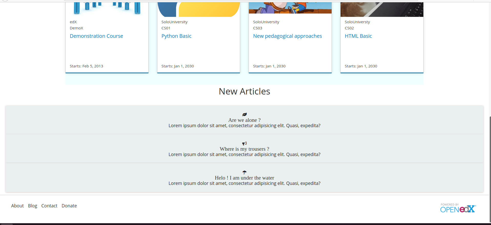

# Comprehensive, custom Open edX theme,  gran

Basic and fully customizable Open edX theme

This theme is a combinations of  https://github.com/overhangio/indigo  and https://github.com/dehamzah/starter-theme-openedx
 
 It's very basic but  powerful, you can change most part of LMS very easily. I tired this on Tutor Juniper(https://docs.tutor.overhang.io/). But it's probably can work with native installations of Open edX also.

 ## Installation:

 Clone this repository:

`git clone https://github.com/murat-polat/gran`

 Render (paver/update) theme:

`tutor config render  ./gran/theme "$(tutor config printroot)/env/build/openedx/themes/gran" `

Rebuild the Open edX docker image::

`tutor images build openedx`

Restart your platform::

`tutor local quickstart`   or  `tutor local start -d`

Set your theme some default theme:

`tutor local settheme gran localhost  $(tutor config printvalue LMS_HOST)`

After your code and customizations, you must repeat all steps above......

Done :)

